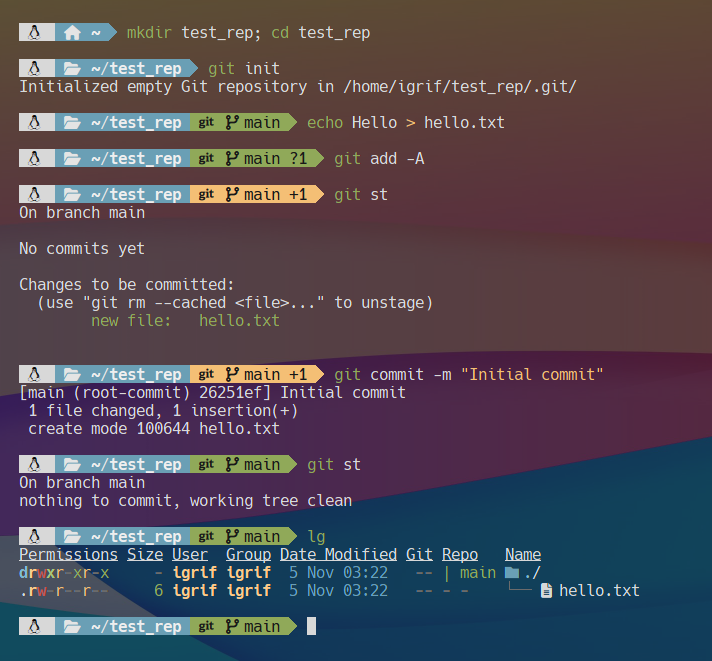

# Установка и настройка Git в Linux, WSL и Windows.

В **Windows** я использую максимально дефолтный клиент,  который можно взять по адресу https://git-scm.com/install/windows. Скачиваем подходящую для нашей системе версию (x64/Arm64) и устанавливаем как обычное приложение. При установке можно оставлять все рекомендуемые опции.

Есть возможность установить это приложение с помощью `winget tool`:

```cmd
winget install --id Git.Git -e --source winget
```

Установка в **Linux** тривиальна:

```bash
sudo apt install -y git
```

> Более подробно про установку в различных дистрибутивах можно почитать здесь: https://git-scm.com/install/linux

## Базовая настройка

```bash
# Установим личные данные
git config --global user.name "My Name"
git config --global user.email "my@email.com"

# Добавим псевдонимы (не обязательно)
git config --global alias.st status
git config --global alias.ps push
git config --global alias.cm commit
git config --global alias.cl clone

# Исправим проблему с кодировкой (обязательно для WSL)
git config --global core.quotepath off

# Имя главной ветки по умолчанию
git config --global init.defaultBranch main
```

Проверим работоспособность:



## Использование SSH ключей

По умолчанию `Git` использует протокол `https` для взаимодействия с сервером, это небезопасно и неудобно. Лучшим решением является использование другого протокола `ssh` или `git`, в которых для аутентификации используются сертификаты безопасности.

В Linux (WSL) пары ключей находятся в директории `~/.ssh/`. Убедившись в их существовании или отсутствии можно определить наличие у вас ssh ключей.

> В Windows ключи располагаются в директории `%homepath%\.ssh\`

Если ключей нет, то их необходимо сгенерировать:

```bash
ssh-keygen -t ed25519 -C "my@email.com"
```

> ```bash
># если нужны RSA ключи
> ssh-keygen -t rsa -b 4096 -C "my@mail.com"
> ```
> 

При запросе пути  сохранения - просто нажмите `Enter` (сохраните дефолтный путь). Пароль можно оставить пустым - это пароль от самого файла ключа, а не от github (можно установить для большей безопасности, но его придется вводить каждый раз при взаимодействии с сервером).

В папке `~/.ssh/` появится два файла ключа, `id_ed25519` - приватный ключ и `id_ed25519.pub` - публичный ключ (его мы будем всем показывать).

Для добавления этого ключа на Github.com нужно выполнить следующие действия:

Сначала скопируем содержимое публичного ключа в буфер обмена:

```bash
cat ~/.ssh/id_ed25519.pub | pbcopy
```

Затем выполним на сайте:

`Иконка профиля` -> `Settings` -> `В меню SSH and GPG keys` -> `New SSH key` -> `Заполнить все поля (Key = содержимое файла id_ed25519.pub)` -> `Add SSH key`.

В завершении, переключим репозиторий на SSH протокол:

```bash
git remote set-url origin git@github.com:login/repo.git
```

Теперь `git push` должен пушить изменения в ваш удаленный репозиторий. Если устанавливали пароль на файл ключа в момент его создания придется его вводить при каждой выгрузке изменений.
> Проверить подключение можно командой:
> ```bash
> ssh -T git@github.com
> ```

> Иногда (в случае ошибок) может потребоваться явно добавить ключ в ssh агент:
>
> ```bash
> eval "$(ssh-agent -s)" # если агент не запущен
> ssh-add ~/.ssh/id_ed25519
> ```

Сгенерированные ключи можно сохранить в надежном месте. Для последующего использования их необходимо скопировать по пути `~/.ssh/` в Linux, WSL или `%homepath%\.ssh\` в Windows.

# Справочник

| Команда                                                   | Описание                                                     |
| :-------------------------------------------------------- | :----------------------------------------------------------- |
| `git init`                                                | Создание репозитория по активному пути                       |
| `git clone <url>`                                         | Клонирование репозитория                                     |
| `git status`                                              | Получение информации о состоянии репозитория                 |
| `git add <file1> <file2>`                                 | Добавление указанных файлов в репозиторий                    |
| `git add -A`                                              | Добавление всех файлов в репозиторий                         |
| `git add .`                                               | Добавление всех необработанных файлов в репозиторий          |
| `git mv <old> <new>`                                      | Перемещение (переименование) файла в репозитории             |
| `git rm <file>`                                           | Удаление файла из репозитория                                |
| `git rm --cached <file>`                                  | "Забыть" файл без его удаления                               |
| `git reset`                                               | Убрать из контроля версий все                                |
| `git reset <file>`                                        | Убрать из контроля версий файл                               |
| `git commit -m "Comment."`                                | Фиксация изменений                                           |
| `git commit -am "Comment."`                               | Фиксация всех изменений                                      |
| `git remote add origin <url>`                             | Подключить удаленный репозиторий                             |
| `git remote set-url origin git@github.com:login/repo.git` | Изменить протокол для удаленного репозитория                 |
| `git push origin main`                                    | Отправка изменений в удаленный репозиторий                   |
| `git pull origin main`                                    | Получение изменений из удаленного репозитория                |
| `git branch awesome_branch`                               | Создание новой ветки                                         |
| `git branch`                                              | Просмотр веток                                               |
| `git checkout awesome_branch`                             | Переключение между ветками                                   |
| `git merge awesome_branch`                                | Слияние текущей ветки с веткой `awesome_branch`              |
| `git rebase main`                                         | Слияние и отбрасывание второй ветки                          |
| `git branch -d awesome_branch`                            | Удаление ветки`awesome_branch`                               |
| `git log`                                                 | Отслеживание изменений, сделанных в коммитах                 |
| `git show <commit_id>`                                    | Просмотр информации о коммите. (Можно писать не весь номер коммита, а только первые несколько символов) |
| `git diff <first_id>..<last_id>`                          | Разница между двумя коммитами                                |
| `git checkout <commit_id> <fille>`                        | Возвращение файла к предыдущему состоянию                    |
| `git rebase -i HEAD~6`                                    | Отбросить последниме 5 фиксаций. Использованна нотация - 6ой от последней фиксации. Также можно подставить ид фиксации. |
| `git revert <commit_id>`                                  | Эта команда создаст коммит, отменяющий изменения, совершенные в коммите с заданным идентификатором. Самый последний коммит может быть доступен по алиасу **HEAD**. |

## .gitignore

В этом файле указываются все исключенные из фиксации файлы и папки. Он должен быть создан вручную в папке с проектом.

> **Пример .gitignore:**
>
> ```
> *.log
> build/
> node_modules/
> .idea/
> my_notes.txt
> ```

## Примеры использования

**Создание локального репозитория:**

```bash
# создание папок и файлов
mkdir my_project
echo hello > hello.txt
# инициализация репозитория
git init
# добавление файлов
git add -A
# первая фиксация
git commit -m "Initial commit"
# просмотр состояния
git status
```

**Работа с удаленным репозиторием:**

```bash
# клонирование репозитория
git clone https://github.com/my-login/repo.git
# подключение по ssh к нему
git remote set-url origin git@github.com:my-login/repo.git
# изменения
cd repo
echo print('hello') > hello.py
git add hello.py
git commit -m "Add hello.py"
# выгрузка изменений в репозиторий
git push origin main
...
# получение изменений из удаленного репозитория
git pull origin main
```


> Официальная документация - https://git-scm.com/doc
