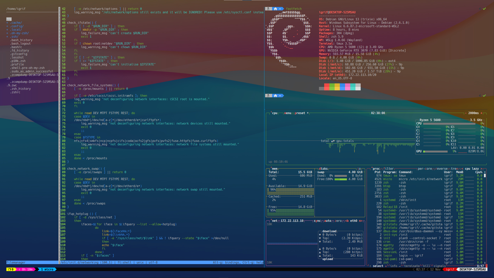

# Заметки и статьи

## Установка и кастомизация WSL

Для выполнения установки и настройки Linux подсистемы в Windows выполнить действия из следующих статей:

Установка и настройка WSL.md

[Tmux - установка, настройка, использование](Tmux - установка, настройка, использование.md) (опционально)

[Git - установка, настройка, использование](Git - установка, настройка, использование.md)

[Установка и настройка ZSH](Установка и настройка ZSH.md)

[Установка и настройка утилит командной строки](Установка и настройка утилит командной строки.md)

